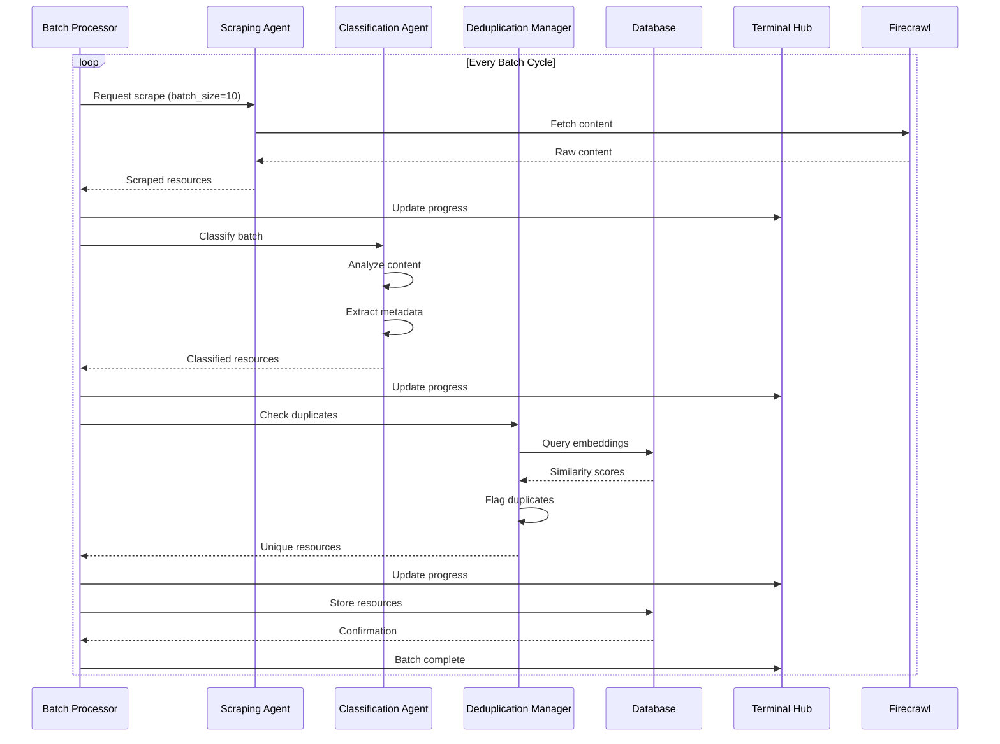
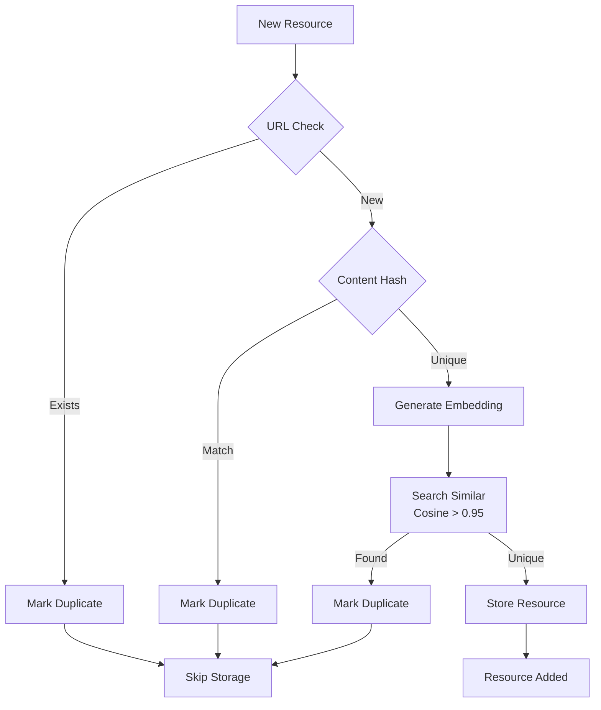
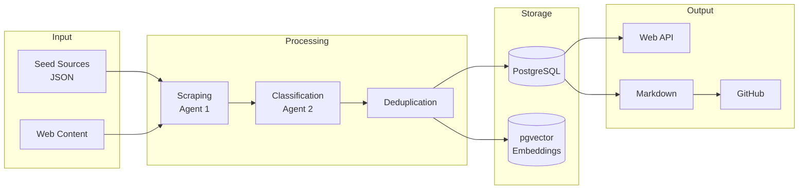
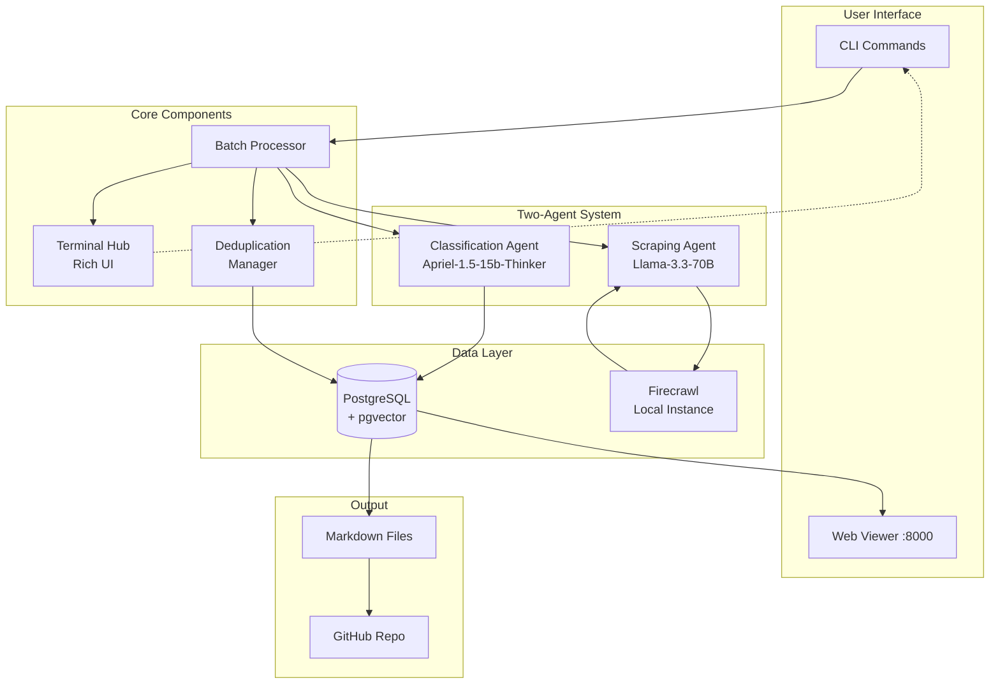

# MLIP Curriculum Crowdsourcing System (Two-Agent Architecture)

An open-source system that continuously scrapes and curates a comprehensive curriculum of papers, lectures, and exercises for Machine-Learned Interatomic Potentials (MLIPs). The system uses **two specialized AI agents** working in a batched processing pipeline to automatically discover, deduplicate, and categorize educational content.

## 🏗️ Two-Agent Architecture

### Agent 1: Scraping Agent (Llama-3.3-70B-Instruct-Turbo-Free)
- **Focus**: Intelligent web scraping and content discovery
- **Capabilities**: 
  - Relevance filtering using MLIP expertise
  - Content extraction and structuring
  - Link discovery and validation
  - Batch processing (10 resources per cycle)

### Agent 2: Classification Agent (ServiceNow-AI/Apriel-1.5-15b-Thinker)
- **Focus**: Document classification and semantic analysis
- **Capabilities**:
  - Deep content analysis and categorization
  - Resource type and difficulty level assignment
  - Topic extraction and metadata enrichment
  - Quality scoring and embedding generation

## 🔄 Batched Processing Pipeline

The system processes resources in controlled batches to ensure quality and prevent overwhelming:

1. **Scrape Phase**: Agent 1 scrapes batch of X resources (default: 10)
2. **Classify Phase**: Agent 2 processes all scraped items
3. **Deduplicate Phase**: System checks for duplicates and flags/removes them
4. **Store Phase**: Validated resources saved to database
5. **Report Phase**: Update terminal hub with batch results
6. **Repeat**: Move to next batch

### Batched Processing Flow



## 📊 Real-time Terminal Hub

The system features a **Rich-based dashboard** showing:

- **Live Progress Panel**: Current batch, items processed, success rate
- **Agent Status Panel**: What each agent is currently doing
- **Statistics Panel**: Total resources, by type, by difficulty
- **Recent Activity Log**: Scrolling log of scraping/classification events
- **Duplication Report**: Flagged duplicates and removal actions
- **Error Tracking**: Failed scrapes and classification errors
- **Performance Metrics**: Processing speed, API usage, database stats

## 🔄 Deduplication System

The system uses a three-tier approach to prevent duplicate content:



### Deduplication Methods

1. **URL Tracking**: Prevents scraping the same URL twice
2. **Content Hashing**: SHA-256 hash comparison for exact duplicates
3. **Semantic Similarity**: Vector embeddings with cosine similarity threshold (0.95)

## 📊 Data Flow Architecture



## 🔒 Security Notice

**IMPORTANT**: This repository does not contain any real API keys or secrets. All sensitive information has been removed from the Git history.

- The `.env` file is gitignored and never committed
- The `.env.example` file contains only placeholder values
- You must create your own `.env` file with your actual API credentials
- Never commit files containing real API keys or secrets

## 📋 Prerequisites & Dependencies Setup Guide

This comprehensive guide provides step-by-step instructions for setting up all required software and tools. This guide is designed to be AI-agent friendly, with clear, executable commands and verification steps.

### System Requirements

- **Python**: 3.8+ (tested with 3.8, 3.10, 3.13)
- **Docker Desktop**: Latest version with WSL2 support (Windows) or native support (Mac/Linux)
- **Memory**: 4GB RAM minimum, 8GB recommended
- **Storage**: 10GB free space for Docker images and data
- **Git**: For cloning repositories
- **Node.js**: 18+ (required for Firecrawl)

### Required Software Installation

#### Docker Installation

**Windows:**
1. Download Docker Desktop from [docker.com](https://www.docker.com/products/docker-desktop/)
2. Enable WSL2 during installation
3. Restart computer if prompted
4. Verify: `docker --version`

**Linux (Ubuntu/Debian):**
```bash
# Update package index
sudo apt update

# Install Docker
sudo apt install docker.io docker-compose

# Add user to docker group
sudo usermod -aG docker $USER

# Log out and back in, then verify
docker --version
```

**Mac:**
1. Download Docker Desktop for Mac from [docker.com](https://www.docker.com/products/docker-desktop/)
2. Choose Intel or Apple Silicon version based on your Mac
3. Install and start Docker Desktop
4. Verify: `docker --version`

#### Python Installation

**Windows:**
1. Download Python from [python.org](https://www.python.org/downloads/)
2. Or install via Windows Store: `winget install Python.Python.3.11`
3. Verify: `python --version`

**Linux:**
```bash
# Ubuntu/Debian
sudo apt update
sudo apt install python3 python3-pip

# Verify
python3 --version
pip3 --version
```

**Mac:**
```bash
# Using Homebrew (recommended)
brew install python

# Or download from python.org
# Verify
python3 --version
```

#### Git Installation

**Windows:**
1. Download Git for Windows from [git-scm.com](https://git-scm.com/download/win)
2. Or install via Windows Store: `winget install Git.Git`
3. Verify: `git --version`

**Linux:**
```bash
# Ubuntu/Debian
sudo apt install git

# Verify
git --version
```

**Mac:**
```bash
# Using Homebrew
brew install git

# Or install Xcode Command Line Tools
xcode-select --install

# Verify
git --version
```

#### Node.js Installation (Required for Firecrawl)

**Windows:**
1. Download Node.js from [nodejs.org](https://nodejs.org/)
2. Choose LTS version (18+)
3. Verify: `node --version` and `npm --version`

**Linux:**
```bash
# Using Node Version Manager (recommended)
curl -o- https://raw.githubusercontent.com/nvm-sh/nvm/v0.39.0/install.sh | bash
source ~/.bashrc
nvm install 18
nvm use 18

# Verify
node --version
npm --version
```

**Mac:**
```bash
# Using Homebrew
brew install node

# Verify
node --version
npm --version
```

### Firecrawl Local Setup

Firecrawl is required for web scraping. Follow these steps to set it up locally:

1. **Clone Firecrawl Repository**
```bash
git clone https://github.com/mendableai/firecrawl
cd firecrawl
```

2. **Set up Firecrawl with Docker**
```bash
# Start Firecrawl services
docker-compose up -d

# Wait for services to start (about 30-60 seconds)
docker-compose logs -f
```

3. **Verify Firecrawl is Running**
```bash
# Check health endpoint
curl http://localhost:3001/health

# Should return: {"status":"ok"}
```

4. **Check Running Containers**
```bash
docker ps
# Should show firecrawl containers running
```

5. **Firecrawl API Key**
- For local setup, usually no API key is required
- If you encounter authentication issues, check Firecrawl documentation
- Default local URL: `http://localhost:3001`

### Together AI API Setup

The system uses Together AI for both scraping and classification agents:

1. **Sign up for Together AI**
   - Visit: [https://api.together.xyz/](https://api.together.xyz/)
   - Create a free account
   - Verify your email address

2. **Generate API Keys**
   - Navigate to Settings → API Keys
   - Click "Create API Key"
   - Copy both the User Key and API Key
   - **Important**: Save these keys securely

3. **Available Models**
   - **Scraping Agent**: `meta-llama/Llama-3.3-70B-Instruct-Turbo-Free`
   - **Classification Agent**: `ServiceNow-AI/Apriel-1.5-15b-Thinker` (via Together AI)
   - **Note**: Free tier includes limited usage, sufficient for testing

### ServiceNow AI / Apriel Setup

**Important**: The ServiceNow AI model may require enterprise access. If unavailable:

1. **Check ServiceNow AI Access**
   - Visit: [https://www.servicenow.com/products/ai-platform.html](https://www.servicenow.com/products/ai-platform.html)
   - Check if you have access to Apriel models

2. **Alternative Models** (if ServiceNow AI unavailable)
   - Use other models available through Together AI
   - Suggested alternatives:
     - `meta-llama/Llama-3.1-70B-Instruct-Turbo`
     - `meta-llama/Llama-3.1-8B-Instruct-Turbo`
   - Update the `CLASSIFICATION_AGENT_MODEL` in your `.env` file

### Setup Checklist

Before proceeding with installation, ensure you have completed:

- [ ] Docker Desktop installed and running
- [ ] Python 3.8+ installed with pip
- [ ] Git installed
- [ ] Node.js 18+ installed
- [ ] Firecrawl running locally at http://localhost:3001
- [ ] Together AI account with API keys
- [ ] PostgreSQL port 5433 available (or modify .env)
- [ ] At least 8GB RAM available
- [ ] Terminal/Command Prompt with admin privileges (Windows)

### Platform-Specific Notes

**Windows:**
- Use PowerShell or Git Bash for best compatibility
- May need to run terminal as Administrator for some commands
- Use forward slashes (/) in .env file paths
- Ensure .env file is saved with UTF-8 encoding

**Linux:**
- Sudo privileges required for system package installation
- Package manager commands vary by distribution (apt/yum/pacman)
- Add user to docker group: `sudo usermod -aG docker $USER`
- Log out and back in after adding to docker group

**Mac:**
- Homebrew recommended for package management
- Apple Silicon vs Intel differences handled automatically by Docker Desktop
- Use Terminal.app or iTerm2

### Verify Installation

After completing all prerequisites, run our verification script:

```bash
python smoke_test.py
```

This will check:
- All required files are present
- All Python modules can be imported
- Environment variables are set correctly
- Database connection works (if PostgreSQL is running)
- Firecrawl is accessible

### Common Installation Issues

**Docker not starting:**
- **Windows**: Enable Hyper-V and WSL2 in Windows Features
- **Mac**: Check system requirements (macOS 10.15+)
- **Linux**: Ensure user is in docker group and restart session

**Port conflicts:**
- **PostgreSQL**: Default port 5432 → we use 5433
- **Firecrawl**: Default port 3001
- **Web viewer**: Default port 8000
- Check ports: `netstat -an | grep :5433` (Windows) or `lsof -i :5433` (Mac/Linux)

**Python import errors:**
- Ensure virtual environment is activated
- Install dependencies: `pip install -r requirements.txt`
- Check Python path issues on Windows

**Firecrawl connection issues:**
- Check containers: `docker ps`
- Check logs: `docker logs firecrawl`
- Verify health: `curl http://localhost:3001/health`
- Restart if needed: `docker-compose restart`

**API key errors:**
- Ensure `.env` file exists in project root
- Check `.env` file has correct variable names
- Verify API keys are valid and not expired
- Test API access separately if needed

---

### Installation

1. Clone the repository:
```bash
git clone <repository-url>
cd mlip-curriculum-crowdsourcing
```

2. Install dependencies:
```bash
pip install -r requirements.txt
```

3. Set up environment variables:
```bash
cp .env.example .env
# Edit .env with your configuration
```

4. Start PostgreSQL with pgvector:
```bash
docker-compose up -d postgres
```

5. Initialize the system:
```bash
python main.py init
```

## 🎮 Usage Commands

### Initialize the System
```bash
python main.py init
```
Creates database tables and initializes seed sources.

### Run Single Batch (Testing)
```bash
python main.py single-batch
```
Processes one batch of resources for testing.

### Run Continuous Processing
```bash
python main.py continuous
```
Starts the continuous batched processing with real-time terminal hub.

### Start Web Viewer
```bash
python main.py web
```
Launches the web interface at `http://localhost:8000`.

## ⚙️ Configuration

### Environment Variables

```env
# Agent 1: Scraping Agent (Llama-3.3-70B)
SCRAPING_AGENT_USER_KEY=your_together_user_key
SCRAPING_AGENT_API_KEY=your_together_api_key
SCRAPING_AGENT_MODEL=meta-llama/Llama-3.3-70B-Instruct-Turbo-Free

# Agent 2: Classification Agent (Apriel-1.5-15b-Thinker)
CLASSIFICATION_AGENT_USER_KEY=your_apriel_user_key
CLASSIFICATION_AGENT_API_KEY=your_apriel_api_key
CLASSIFICATION_AGENT_MODEL=ServiceNow-AI/Apriel-1.5-15b-Thinker

# Batch Processing
BATCH_SIZE=10
MAX_CONCURRENT_BATCHES=2
SCRAPING_DELAY_SECONDS=2

# Terminal Hub
TERMINAL_HUB_REFRESH_RATE=1.0
TERMINAL_HUB_LOG_LINES=50
```

## 📚 Seed Sources

The system comes with a curated list of MLIP-focused sources:

- **arXiv**: Machine learning and computational physics papers
- **GitHub**: Popular MLIP frameworks (MACE, NequIP, SchNet, Allegro, etc.)
- **Documentation**: Framework docs and tutorials
- **Academic Sources**: University course materials
- **Community Resources**: Tutorials and educational content

## 🗂️ Content Organization

### Resource Types
- **Papers**: Academic papers and research articles
- **Lectures**: Video lectures and course materials
- **Exercises**: Hands-on exercises and coding tutorials
- **Documentation**: API docs and technical guides
- **Tutorials**: Step-by-step guides and walkthroughs

### Difficulty Levels
- **Beginner**: Introduction to concepts, basic understanding required
- **Intermediate**: Some background knowledge needed, practical applications
- **Advanced**: Deep technical knowledge required, research-level content
- **Expert**: Cutting-edge research, requires extensive domain expertise

## 🔧 System Architecture

### High-Level Architecture



### Core Components

- **Database**: PostgreSQL + pgvector for storage and semantic similarity
- **Scraping Pipeline**: Firecrawl + LangChain integration
- **Deduplication**: Three-tier approach (URL, hash, embeddings)
- **Terminal Hub**: Rich-based real-time monitoring
- **Web Viewer**: FastAPI-based browsing interface

### Key Features

✅ **Two-Agent Specialization**: Each agent focuses on its expertise  
✅ **Batched Processing**: Controlled, quality-focused processing  
✅ **Real-time Monitoring**: Live terminal dashboard  
✅ **Robust Deduplication**: Multi-method duplicate prevention  
✅ **Community Expandable**: Easy to add new seed sources  
✅ **Local-First Testing**: Works with local Firecrawl before scaling  

## 🔧 Troubleshooting

### Common Issues and Solutions

#### Database Connection Problems
```bash
# Check if PostgreSQL container is running
docker ps | grep postgres

# Restart PostgreSQL container
docker-compose restart postgres

# Check connection from host
docker exec mlip-curriculum-crowdsourcing-postgres-1 psql -U postgres -d mlip_curriculum -c "SELECT version();"
```

#### API Key Configuration Errors
- Ensure `.env` file exists and contains valid API keys
- Verify Together AI credentials are active
- Check API key permissions and quotas
- Test API connectivity: `python -c "from src.scraping_agent import ScrapingAgent; print('API OK')"`

#### Firecrawl Setup Issues
```bash
# Check Firecrawl is running locally
curl http://localhost:3001/health

# Verify Firecrawl API key
curl -H "Authorization: Bearer YOUR_API_KEY" http://localhost:3001/scrape
```

#### Terminal Encoding Problems (Windows)
```bash
# Set UTF-8 encoding
chcp 65001

# Or use PowerShell with UTF-8
$env:PYTHONIOENCODING="utf-8"
```

#### Docker Container Issues
```bash
# Clean up containers and volumes
docker-compose down -v
docker system prune -f

# Rebuild and start fresh
docker-compose up -d postgres
```

## 🧪 Testing

### Quick Test Verification

The system includes comprehensive tests that work with your real environment variables:

```bash
# Install test dependencies
pip install -r test_requirements.txt

# Run all tests
pytest -v

# Run specific test categories
pytest -m unit -v          # Unit tests only
pytest -m integration -v  # Integration tests only

# Run smoke test for quick verification
python smoke_test.py
```

### Test Structure

The test suite is organized into focused, working tests:

**Unit Tests** (`test_real_system.py`):
- Test individual components with real environment variables
- Verify component initialization and method availability
- Test data structures and configuration validation
- Test component integration

**Integration Tests** (`test_real_integration.py`):
- Test component interactions and data flow
- Test actual functionality with real API keys
- Test embedding generation and content processing
- Test system-wide component coordination

### Test Categories

- **Unit Tests**: Test individual components in isolation with real environment
- **Integration Tests**: Test component interactions and data flow
- **Smoke Tests**: Quick verification that system is working
- **Environment Tests**: Verify API keys and configuration are properly loaded

### Test Coverage

The test suite covers:
- ✅ Environment variable loading and validation
- ✅ All module imports and initialization
- ✅ Component method availability and structure
- ✅ Data structure validation
- ✅ Configuration file validation
- ✅ Component integration and data flow
- ✅ Real API key usage and functionality

## 📚 API Reference

### CLI Commands

#### `python main.py init`
Initializes the system by creating database tables and loading seed sources.

**Options:**
- `--force`: Recreate tables even if they exist
- `--seed-only`: Only load seed sources, skip table creation

#### `python main.py single-batch`
Processes one batch of resources for testing.

**Options:**
- `--batch-size N`: Number of resources to process (default: 10)
- `--dry-run`: Show what would be processed without actually processing

#### `python main.py continuous`
Starts continuous batched processing with real-time terminal hub.

**Options:**
- `--batch-size N`: Resources per batch (default: 10)
- `--interval-minutes N`: Minutes between batches (default: 60)
- `--max-batches N`: Maximum batches to process (default: unlimited)

#### `python main.py web`
Launches the web interface.

**Options:**
- `--host HOST`: Host to bind to (default: 0.0.0.0)
- `--port PORT`: Port to bind to (default: 8000)

### Database Schema

#### Resources Table
```sql
CREATE TABLE resources (
    id SERIAL PRIMARY KEY,
    url VARCHAR UNIQUE NOT NULL,
    title VARCHAR NOT NULL,
    content_hash VARCHAR UNIQUE,
    content_markdown TEXT NOT NULL,
    resource_type VARCHAR,
    difficulty_level VARCHAR,
    source_site VARCHAR,
    scraped_at TIMESTAMP DEFAULT NOW(),
    embedding VECTOR(1536),
    is_duplicate BOOLEAN DEFAULT FALSE
);
```

#### Scrape History Table
```sql
CREATE TABLE scrape_history (
    id SERIAL PRIMARY KEY,
    url VARCHAR UNIQUE NOT NULL,
    last_scraped TIMESTAMP DEFAULT NOW(),
    status VARCHAR DEFAULT 'success'
);
```

### Agent Interfaces

#### Scraping Agent
```python
class ScrapingAgent:
    async def scrape_url(self, url: str) -> Dict[str, Any]
    async def get_urls_to_scrape(self, limit: int = 10) -> List[str]
    async def perform_scraping_batch(self, batch_size: int = 10) -> List[Dict]
```

#### Classification Agent
```python
class ClassificationAgent:
    async def categorize_content(self, content: str) -> Dict[str, str]
    async def process_and_store_resource(self, resource_data: Dict) -> Resource
    async def generate_embedding(self, text: str) -> List[float]
```

## ⚡ Performance Tuning

### Batch Size Optimization

**Small Batches (5-10 resources):**
- Pros: Lower memory usage, faster feedback
- Cons: More API calls, higher overhead
- Best for: Testing, limited resources

**Large Batches (20-50 resources):**
- Pros: Better throughput, fewer API calls
- Cons: Higher memory usage, slower feedback
- Best for: Production, high-volume processing

### Rate Limiting Configuration

```env
# Adjust delays based on API limits
SCRAPING_DELAY_SECONDS=2          # Between scrapes
CLASSIFICATION_DELAY_SECONDS=1    # Between classifications
BATCH_DELAY_SECONDS=30            # Between batches
```

### Database Indexing

```sql
-- Optimize common queries
CREATE INDEX idx_resources_type ON resources(resource_type);
CREATE INDEX idx_resources_difficulty ON resources(difficulty_level);
CREATE INDEX idx_resources_scraped ON resources(scraped_at);
CREATE INDEX idx_resources_duplicate ON resources(is_duplicate);

-- Vector similarity index
CREATE INDEX ON resources USING ivfflat (embedding vector_cosine_ops);
```

### Embedding Cache Strategies

- **Memory Cache**: Store embeddings in Redis for fast access
- **File Cache**: Persist embeddings to disk for persistence
- **Database Cache**: Use PostgreSQL for embedding storage

```env
# Enable embedding caching
EMBEDDING_CACHE_ENABLED=true
EMBEDDING_CACHE_SIZE=10000
EMBEDDING_CACHE_TTL=86400
```

## 🤝 Contributing

### Development Setup

1. Fork the repository
2. Clone your fork: `git clone https://github.com/YOUR_USERNAME/mlip-curriculum-crowdsourcing.git`
3. Create a feature branch: `git checkout -b feature/your-feature-name`
4. Install development dependencies: `pip install -r test_requirements.txt`
5. Run tests to ensure everything works: `pytest`

### Code Style Guide

- Follow PEP 8 Python style guidelines
- Use type hints for all function parameters and return values
- Write docstrings for all classes and functions
- Keep functions under 50 lines when possible
- Use meaningful variable and function names

### Commit Message Conventions

Use conventional commits format:
```
type(scope): description

feat(scraping): add rate limiting to prevent API overload
fix(database): resolve connection pool exhaustion
docs(readme): add troubleshooting section
test(agents): add unit tests for classification agent
```

### Testing Requirements

- All new features must include unit tests
- Integration tests required for component interactions
- Maintain test coverage above 70%
- Run `pytest --cov=src` before submitting PR

### Pull Request Process

1. Ensure all tests pass: `pytest`
2. Update documentation if needed
3. Add your changes to CHANGELOG.md
4. Submit PR with clear description of changes
5. Request review from maintainers

### Adding New Seed Sources

Edit `src/seed_sources.json` to add new sources:

```json
{
  "url": "https://example.com",
  "source_type": "tutorial",
  "crawl_frequency": "weekly",
  "priority": 8,
  "description": "Description of the source",
  "enabled": true
}
```

### Reporting Issues

When reporting issues, please include:
- Python version and OS
- Steps to reproduce
- Expected vs actual behavior
- Relevant log output
- Configuration details (without API keys)

## 📄 License

This project is licensed under the MIT License - see the LICENSE file for details.

## 🙏 Acknowledgments

- Built with [Firecrawl](https://firecrawl.dev/) for web scraping
- Uses [LangChain](https://langchain.com/) for document processing
- Powered by [Together AI](https://together.ai/) for both agents
- Vector similarity with [pgvector](https://github.com/pgvector/pgvector)
- Terminal UI with [Rich](https://rich.readthedocs.io/)

## 📞 Support

For questions, issues, or contributions, please open an issue on GitHub or contact the maintainers.
